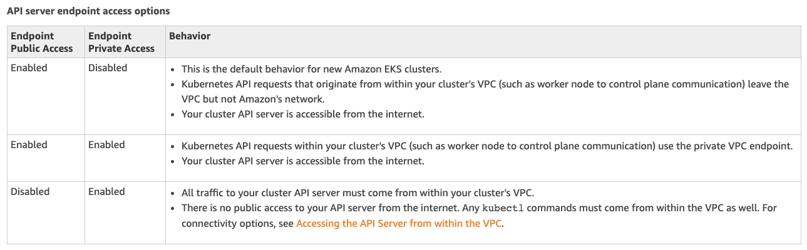

A large chunk of this repo has been taken from [AWS EKS Introduction; Terraform example](https://learn.hashicorp.com/terraform/aws/eks-intro). However, this repository has been modified
- to enable both public and private endpoints. This behavior allows Kubernetes API requests within your cluster's VPC (such as worker node to control plane communication) use the private VPC endpoint
- Saves terraform state in a S3 bucket



## Prerequisites
- Ensure that AWS credentials are available at: "~/.aws/credentials" on the host dev machine
```
      [default]
      aws_access_key_id = <KEY>
      aws_secret_access_key = <SECRET>
      region = <REGION>
```
- Ensure that a S3 bucket as a backend type is created. See the docs [here](https://www.terraform.io/docs/backends/types/s3.html)
```
      terraform {
        # It is expected that the bucket, globally unique, already exists
        backend "s3" {
          # you will need a globally unique bucket name
          bucket  = "ci.terraform"
          key     = "eks/terraform.tfstate"
          region  = "<REGION>"
          encrypt = true
        }
      }
```

## Setup guestbook app
1. See `kubectl_config.tf` for configuring the cluster which is a manual process
2. you should be able to use kubectl to view node status: `kubectl get nodes --watch`
3. Finally, you can deploy a guestbook application: `https://docs.aws.amazon.com/eks/latest/userguide/eks-guestbook.html`
4. Then you should be able to get the endpoint with kubectl: `ubectl get services -o wide` e.g. http://adf8587e8822b11e985ed06aa4a3435a-1242824340.eu-west-2.elb.amazonaws.com:3000/
5. Then deploy the kubernetes web UI (Dashboard): `https://docs.aws.amazon.com/eks/latest/userguide/dashboard-tutorial.html`

## References
1. [Kubernetes architecture and concepts tutorial - Kubernetes Administration for beginners](https://youtu.be/oFglQ50O_rU)
2. [Kubernetes - Services Explained](https://youtu.be/5lzUpDtmWgM)
